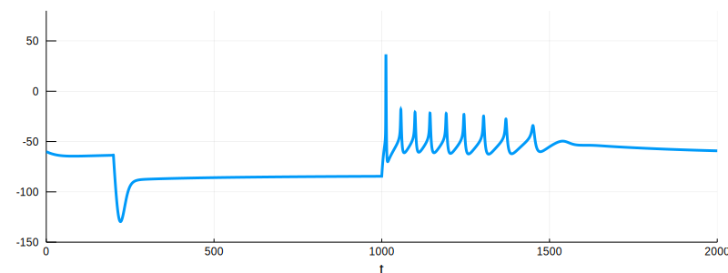
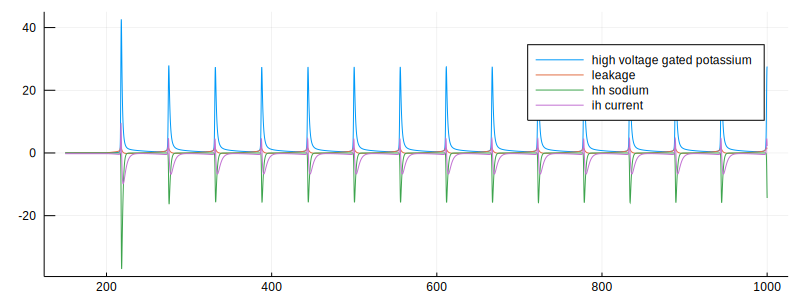

# HHModel.jl

conductance based neuronal modeling.

## demos

## deps
- [DifferentialEquations.jl](https://github.com/JuliaDiffEq/DifferentialEquations.jl)

## TODO list
- documentation and workflow
- make playground files more readable.
- complex ltk channel
- calculate current of each channel during current clamp
- post-synaptic potential/current simulation
- voltage clamp
- model struct and wrap simulation into one method.

## change logs
#### 10/07/2019
- basic framework
    - Kinetics
    - SimpleIonChannel
    - ComplexIonChannel
    - GenericIonChannel
    - modelgeneration
- channel zoo
    - high voltage gated potassium channel
    - low voltage gated potassium channel
    - hh sodium channel
    - hh potassium channel
    - ih current
    - leakage current
